# **EcoVentus: AI-Driven UAV Monitoring Platform**

## **Overview**
**EcoVentus** is an advanced AI-powered platform designed to optimize UAV (Unmanned Aerial Vehicle) operations for industries like environmental monitoring, renewable energy, and agriculture. By combining real-time data collection, route planning, and analytics, EcoVentus enables precise, efficient, and sustainable solutions for monitoring and managing key resources.

The platform integrates a web-based interface to control and visualize UAV missions, leveraging artificial intelligence to detect patterns, analyze data, and support informed decision-making.

---

## **Key Features**
- **Real-Time Monitoring**: Visualize UAV flight paths and data collection in real-time.
- **Customizable Drone Configuration**: Adjust parameters such as altitude, speed, and mission priority.
- **AI-Driven Insights**: Automatically detect and analyze patterns in collected data.
- **Interactive Dashboard**:
  - View mission priority scores and flight times.
  - Download Waypoint (WP) files for custom UAV configurations.
  - Visualize routes on a detailed map.
- **Scalable Use Cases**:
  - Renewable energy: Inspect solar panels and wind turbines for efficiency and damage detection.
  - Agriculture: Monitor crop health and optimize land use.
  - Environmental assessment: Track deforestation, wildlife habitats, and urban development impact.

---

## **Tech Stack**
### **Frontend**
- **HTML5, CSS3, JavaScript**: For creating a responsive and interactive web interface.
- **Leaflet.js**: To render detailed maps and real-time UAV paths.
- **React** (Optional): Scalable UI development.

### **Backend**
- **Node.js**: API development for communication between drones and the platform.
- **Python**: For AI algorithms and data processing.
- **Flask**: For hosting machine learning models.

### **Database**
- **MongoDB**: Storing UAV routes, flight logs, and user information.

### **AI/ML Frameworks**
- **TensorFlow / PyTorch**: For pattern recognition and anomaly detection.

### **Cloud Integration**
- **Google Cloud Vision API**: For image classification and analysis.
- **AWS** or **Google Cloud**: For scalable hosting and database solutions.

---

## **How to Run the Project**
### **1. Prerequisites**
Ensure you have the following installed:
- **Node.js** (v16+)
- **Python** (v3.9+)
- **MongoDB**
- **Google Cloud API Key** (for Vision API integration)

### **2. Clone the Repository**

1. **Clone the repository:**

   ```bash
   git clone [https://github.com/AzulRK22/fire-eye-dashboard.git](https://github.com/AzulRK22/queenDrones.git)
   cd queenDrones
   ```

2. **Set up the frontend:**

   ```bash
   cd frontend
   npm install
   ```

3. **Set up the backend:**

   ```bash
   cd ../backend
   python -m venv venv
   source venv/bin/activate
   pip install -r requirements.txt
   flask db upgrade
   ```

4. **Start the frontend:**

   ```bash
   cd ../frontend
   npm run dev
   ```

5. **Start the backend:**

   ```bash
   flask run
   flask --app app.py --debug run
   ```

6. **Access the application:**

   Open your browser and go to http://localhost:3000 to see the application running.

## Screenshots

### Home
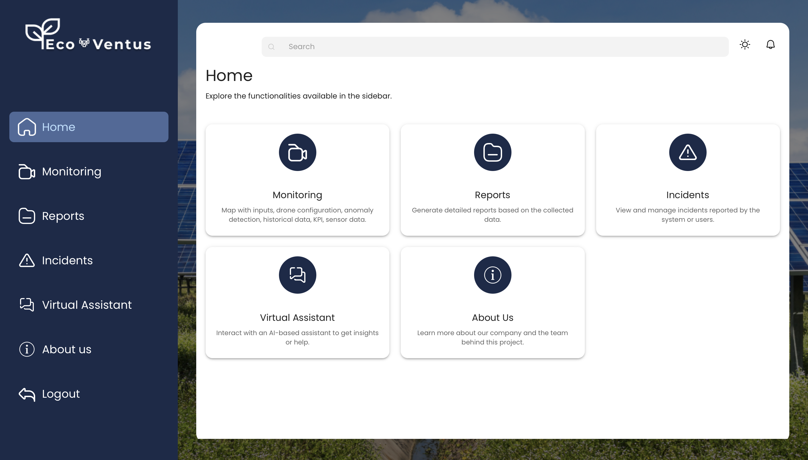

### Monitoring
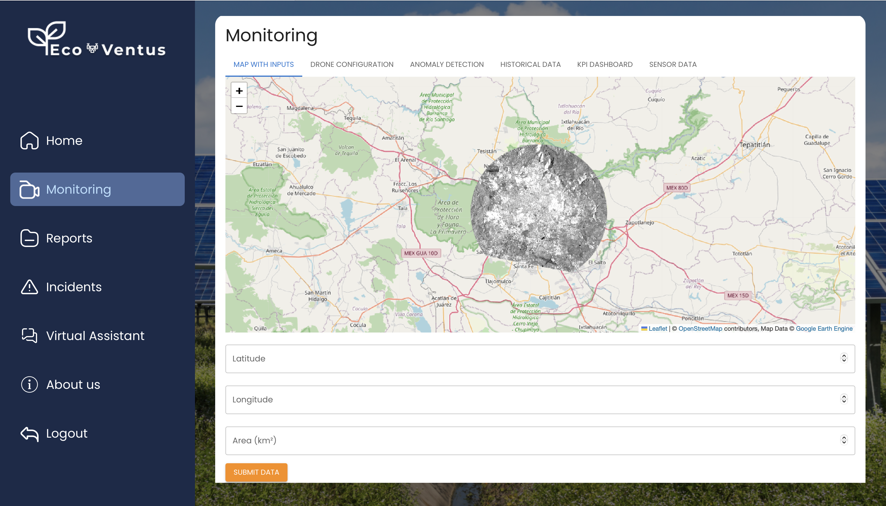
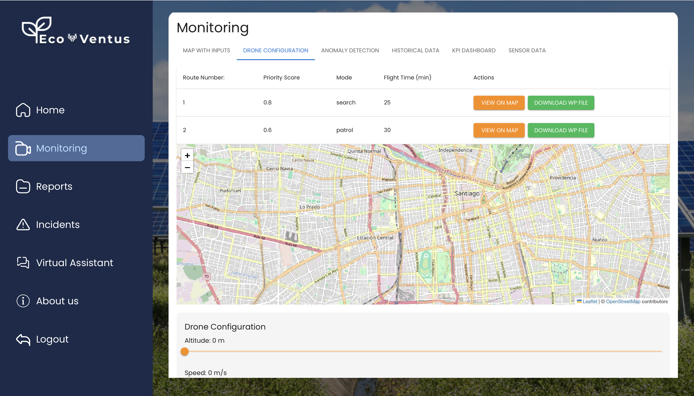
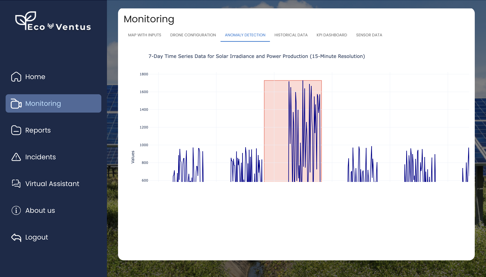
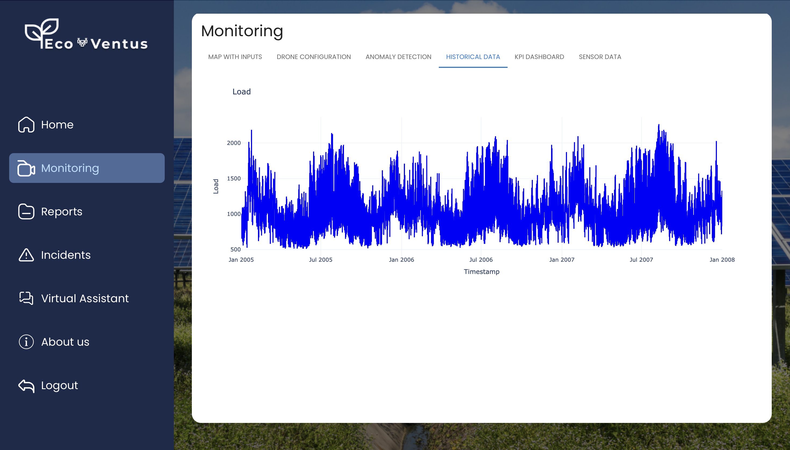
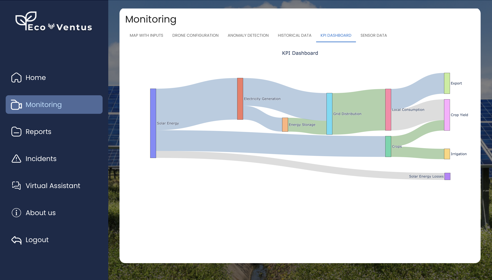
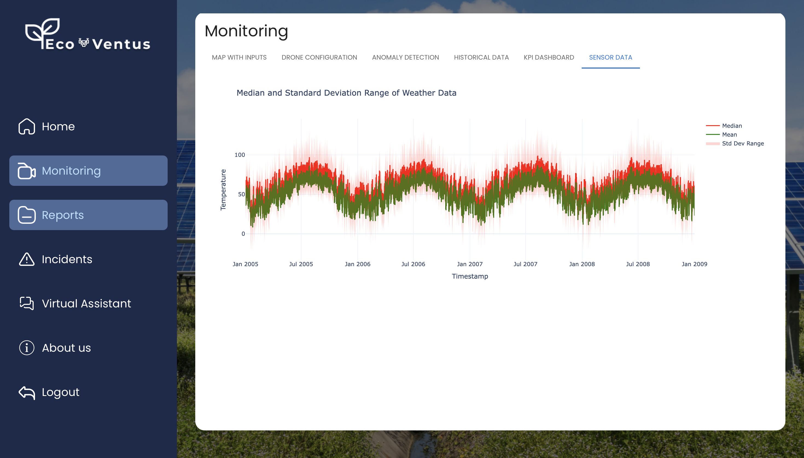

### Reports
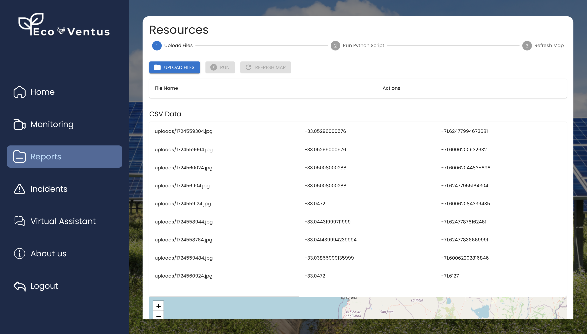

### Incidents
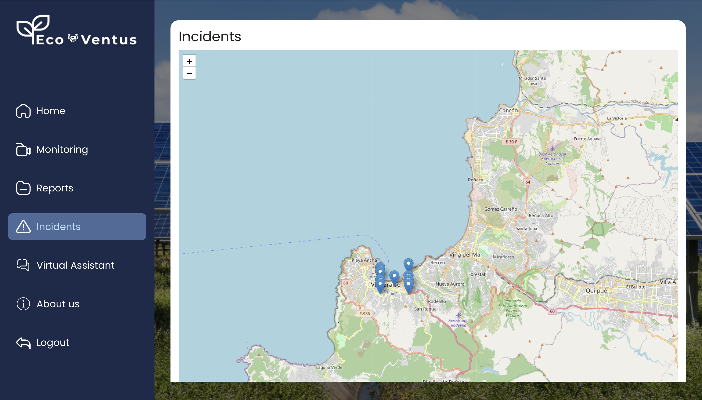

### Virtual Assistant
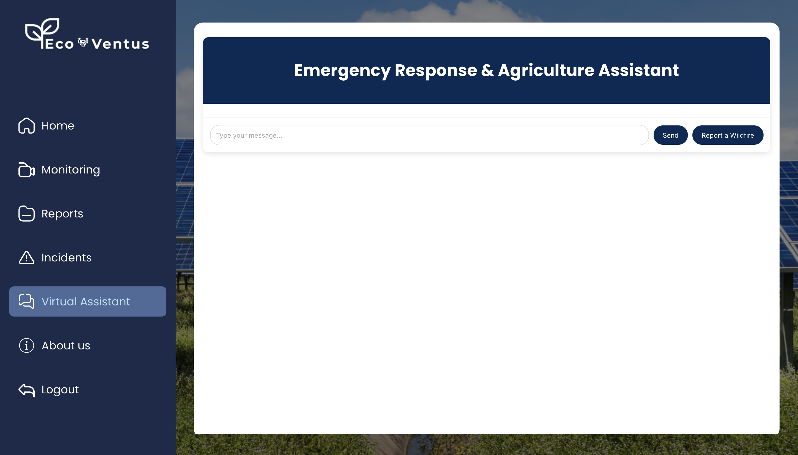

### About us
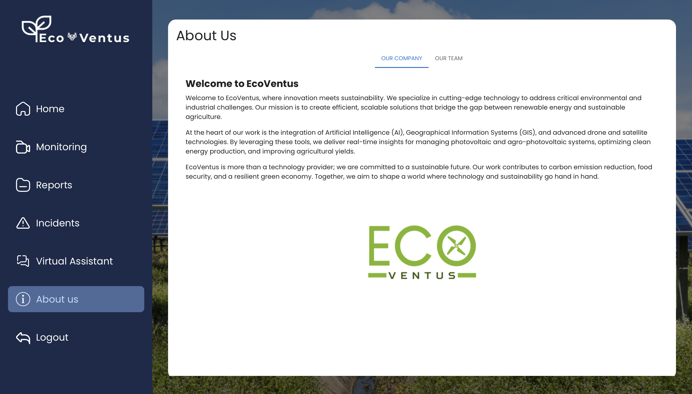

## **Use Cases**
### **1. Renewable Energy**
- Inspect wind turbines for cracks and defects.
- Monitor solar panel efficiency and cleanliness.

### **2. Agriculture**
- Track irrigation levels and optimize water usage.
- Identify crop diseases and pest infestations.

### **3. Environmental Monitoring**
- Monitor urban development's environmental impact.
- Detect illegal deforestation and changes in wildlife habitats.

---

## **Team Contributions**
### **Multidisciplinary Expertise**:
- **Electronics Engineering**: Designed and integrated UAV hardware components.
- **Software Engineering**: Developed AI algorithms and the web-based interface.
- **Data Analysis**: Processed UAV data for actionable insights.
- **Environmental Engineering**: Ensured eco-friendly operations.
- **Market Research**: Tailored solutions for specific industries.

---

## **License**
This project is licensed under the MIT License. See the [LICENSE](LICENSE) file for more details.

---

## **Contact**
For more details or to collaborate on this project, please contact:  
https://www.azulrk.com
